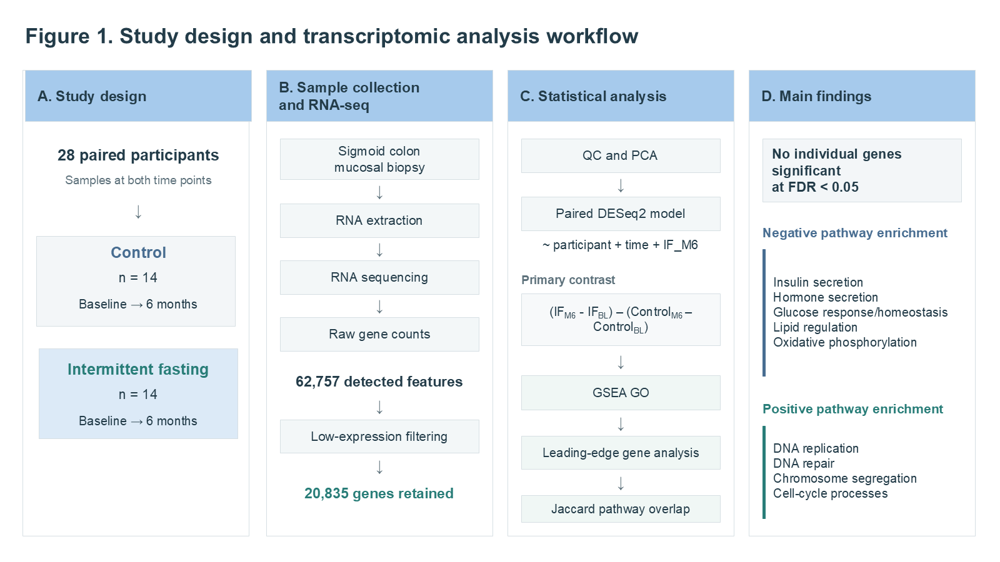
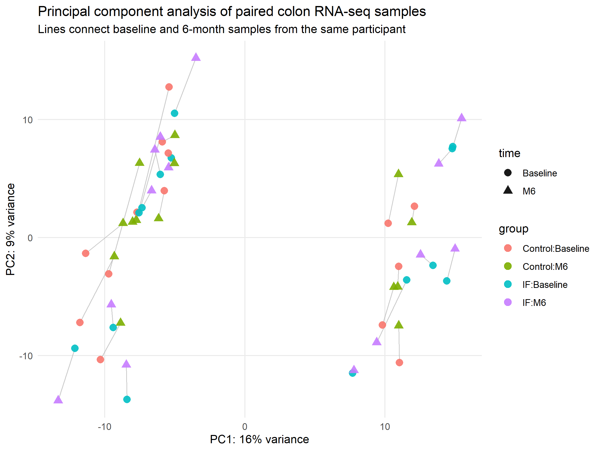
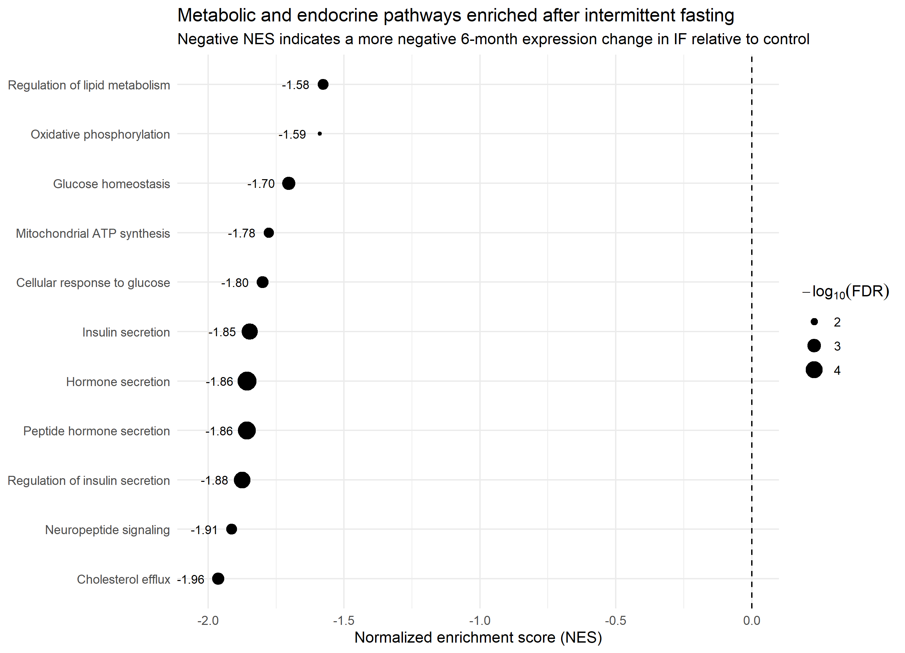
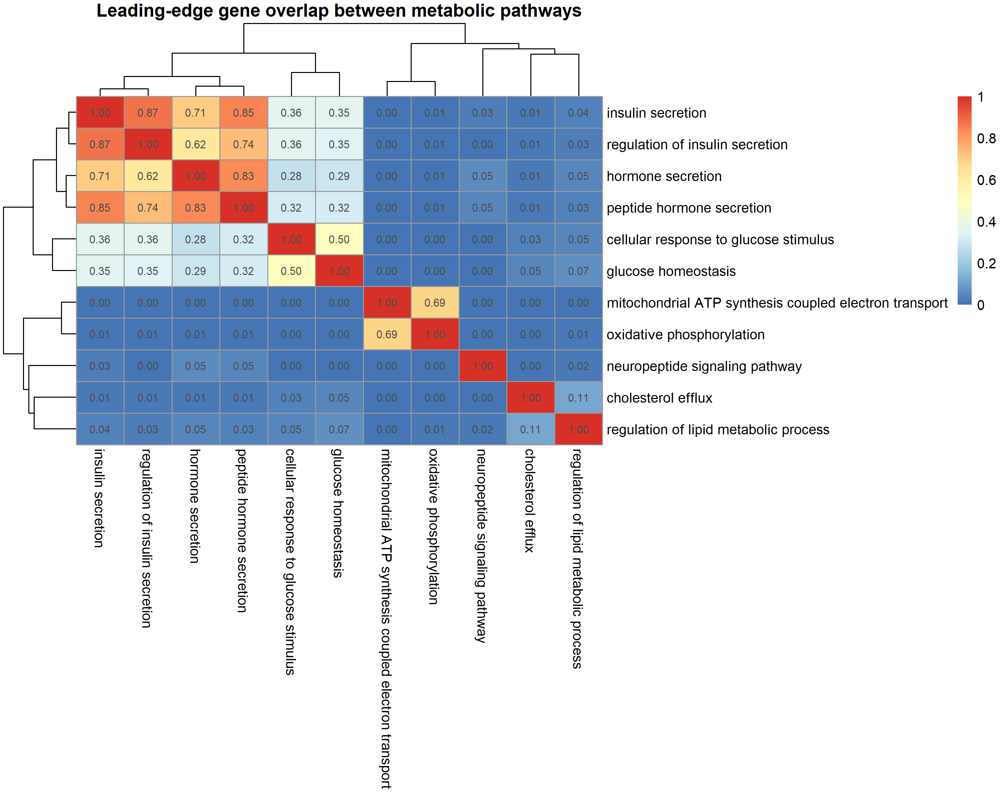
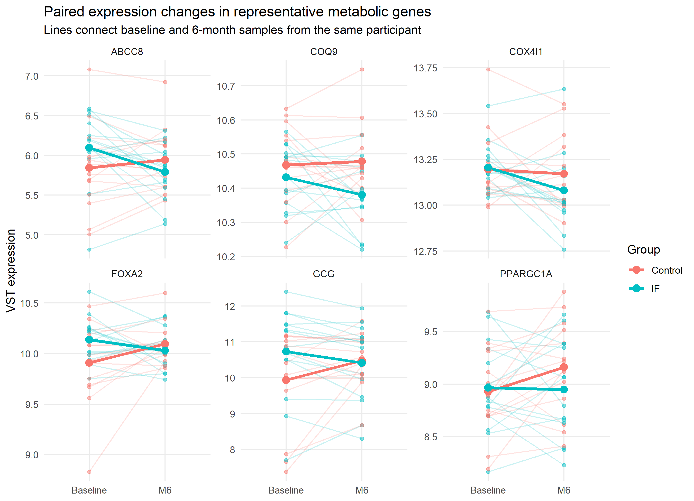
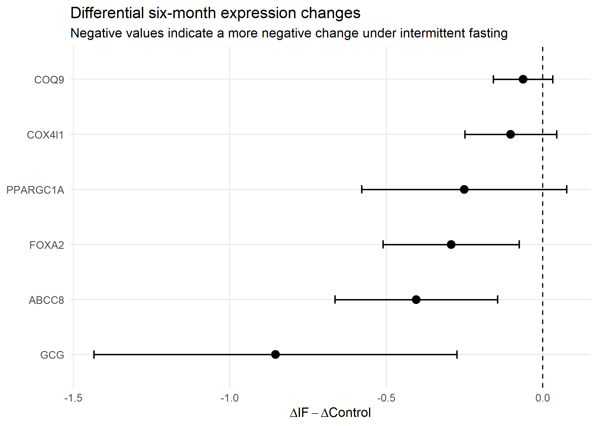

# The effects of intermittent fasting on Human Sigmoid Colon Transcriptomics

## Overview

Paired RNA-seq analysis of the GSE196335 clinical trial, where participants practiced intermittent fasting over 6 months. DESeq2 was used to model differential expression, GSEA GO was used to investigate pathway-level effects.

The analysis focused on identifying coordinated changes in metabolic, endocrine, mitochondrial or proliferative transcriptional programmes in sigmoid colon mucosa.

The primary point of comparision used for this analysis was:

`(IF_M6 - IF_Baseline) - (Control_M6 - Control_Baseline)`

This allowed the six-month expression change between intermittent fasting and control groups to be quantified while accounting for repeated measurements within individuals.

---

## Study Design

- **28 participants with paired RNA-seq samples**
- **Control:** n = 14
- **Intermittent fasting:** n = 14
- **Timepoints:** Baseline and 6 months
- **Tissue:** Sigmoid colon mucosal biopsy
- **Total samples analysed:** 56

<p align="center">
  
</p>

*Figure 1. Study design and transcriptomic analysis workflow.*

---

## Data Source

RNA-seq data were obtained from:

**GEO accession:** GSE196335  
**Study:** Metabolic and molecular effects of intermittent fasting in humans

Raw gene count files from paired baseline and six-month sigmoid colon samples were used.

---

## RNA-seq Processing

The original count data contained 62,757 features. This was filtered down using the following conditions:

- at least 10 counts
- in at least 4 samples

This retained 20,835 genes across 56 samples.

Variance-stabilising transformation (VST) from DESeq2 was used for exploratory analyses and visualisation.

---

## Quality Control

Quality control:

- sequencing library-size assessment
- variance-stabilised (VST) expression distributions
- sample-to-sample correlation
- principal component analysis (PCA)
- inspection of paired baseline and six-month samples

The PCA showed that global transcriptomic variation was not primarily driven by intervention group or timepoint, with substantial inter-individual variation remaining across samples.

<p align="center">
  
</p>

*Figure 2. Principal component analysis of paired sigmoid-colon RNA-seq samples. Lines connect baseline and six-month samples from the same participant.*

---

## Differential Expression Analysis

Differential expression was performed using **DESeq2** with a paired longitudinal model:

```r
~ participant + time + IF_M6
```

where `IF_M6` represents samples belonging to the intermittent fasting group at six-months.

The corresponding coefficient estimates:

`(IF_M6 - IF_Baseline) - (Control_M6 - Control_Baseline)`

No individual genes reached FDR < 0.05, suggesting intervention effects were not caused by large single-gene changes.

---

## Gene Set Enrichment Analysis

Used to identify coordinated pathway-level effects, genes were ranked using the DESeq2 Wald statistic and analysed using **Gene Set Enrichment Analysis (GSEA)** against **Gene Ontology Biological Process** terms.

Multiple pathways showed significant coordinated enrichment.

### Negative Enrichment

Intermittent fasting was associated with more negative relative expression changes in pathways:

- insulin secretion
- regulation of insulin secretion
- hormone secretion
- peptide hormone secretion
- cellular response to glucose
- glucose homeostasis
- regulation of lipid metabolism
- cholesterol efflux
- oxidative phosphorylation
- mitochondrial ATP synthesis
- neuropeptide signalling

<p align="center">
  
</p>

*Figure 3. Focused GO Biological Process GSEA of metabolic, endocrine, and mitochondrial pathways. Negative NES indicates a more negative six-month expression change in the intermittent fasting group relative to control.*

---

## Positive Enrichment

Most enriched pathways in IF:

- DNA replication
- DNA recombination
- double-strand break repair
- homologous recombination
- chromosome segregation
- sister chromatid segregation
- spindle organisation
- cell-cycle checkpoint signalling

These results indicate coordinated enrichment of proliferative and genome-maintenance programmes in the positive direction of the fasting-specific contrast.

---

## Leading-Edge and Pathway-Overlap Analysis

Leading-edge genes were extracted from focused GSEA pathways to identify which genes were most responsible for pathway enrichment.

Jaccard similarity used to measure overlap between pathway leading-edge gene sets.

Identified three broad transcriptional modules:

- **Endocrine / secretory**
- **Glucose response / homeostasis**
- **Mitochondrial oxidative metabolism**

The endocrine and glucose modules showed moderate overlap, whereas the mitochondrial module was largely distinct.

<p align="center">
  
</p>

*Figure 4. Jaccard similarity between leading-edge gene sets from selected metabolic and endocrine pathways.*

---

## Representative Gene Expression Changes

Representative genes were selected from each module to visualise participant-level expression trajectories.

E.g:

- **ABCC8**
- **FOXA2**
- **GCG**
- **PPARGC1A**
- **COX4I1**
- **COQ9**

Thin lines represent individual participants, while bold lines represent group mean trajectories.

<p align="center">
  
</p>

*Figure 5. Paired baseline-to-six-month expression trajectories for representative genes.*

---

## Differential Six-Month Changes

For selected representative genes, the mean expression change was summarised as:

`ΔIF - ΔControl`

where:

`Δ = M6 - Baseline`

All selected genes showed a more negative mean change under intermittent fasting relative to control.

The largest relative changes were observed for:

- **GCG**
- **ABCC8**
- **FOXA2**
- **PPARGC1A**

<p align="center">
  
</p>

*Figure 6. Differential six-month expression changes for selected representative genes.*

---

## Main Findings

The analysis identified a clear distinction between gene-level and pathway-level results:

- no individual genes reached genome-wide FDR significance
- coordinated pathway-level effects were detectable using GSEA
- endocrine and glucose-regulatory pathways showed negative enrichment
- mitochondrial oxidative phosphorylation pathways also showed negative enrichment
- DNA replication, DNA repair, and chromosome-segregation pathways showed strong positive enrichment
- endocrine and glucose-response pathways shared substantial leading-edge gene overlap
- mitochondrial pathways formed a comparatively distinct transcriptional module

These results suggest that intermittent fasting may be associated with coordinated transcriptional remodelling rather than large isolated gene-expression changes.

---

## Interpretation

Negative enrichment was identified in endocrine and metabolic pathways identified, these should not be interpreted as evidence for reduced physiological hormone secretion.

RNA-seq data and GSEA show coordinated transcriptional changes within sigmoid colon mucosa tissue.

---

## Limitations

- relatively small sample size
- bulk RNA-seq rather than single-cell RNA-seq
- possible changes in tissue cell composition
- pathway overlap and redundancy within Gene Ontology
- lack of individual FDR-significant genes
- representative genes were selected after pathway-level analysis and are therefore exploratory
- sigmoid colon gene expression should not be interpreted as a direct measurement of systemic endocrine activity

A useful future analysis would be cell-type deconvolution or marker-based analysis to determine whether the observed pathway enrichment reflects changes in cell composition or within-cell transcriptional regulation.

---

## Repository Structure

```text
intermittent-fasting-transcriptomics/
├── analysis/
│   ├── 01_data_import_qc.R
│   ├── 02_deseq2_analysis.R
│   ├── 03_gsea_analysis.R
│   └── 04_figures_tables.R
├── data/
│   ├── README.md
│   └── metadata_GSE196335_main.csv
├── figures/
├── tables/
├── session_info.txt
└── README.md

```

## Reproducibility

The analysis scripts are organised sequentially:

1. Data import and quality control
2. DESeq2 differential-expression analysis
3. GSEA and pathway-overlap analysis
4. Figure and table generation

Raw gene-count files are not stored in this repository and can be obtained from GEO accession **GSE196335**.

---

## Tools and Packages

Analysis was performed in **R** using packages including:

- DESeq2
- clusterProfiler
- org.Hs.eg.db
- AnnotationDbi
- ggplot2
- pheatmap
- dplyr
- tidyr
- GEOquery
- BiocParallel

---

## Data Availability

The RNA-seq dataset is publicly available from the NCBI Gene Expression Omnibus under accession **GSE196335**.

Raw count files are intentionally not duplicated in this repository.
